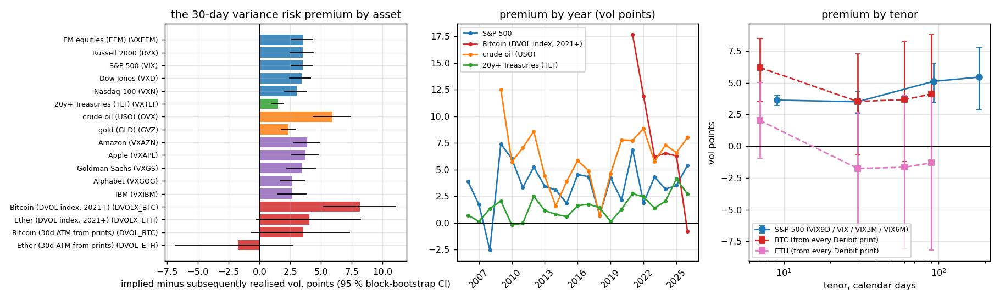
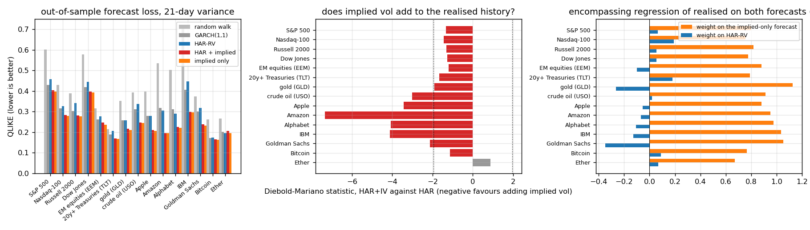
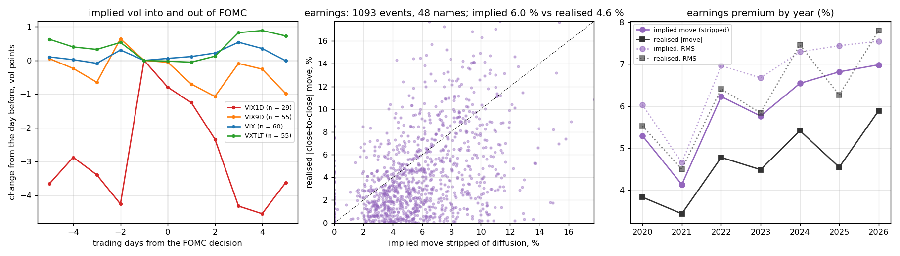
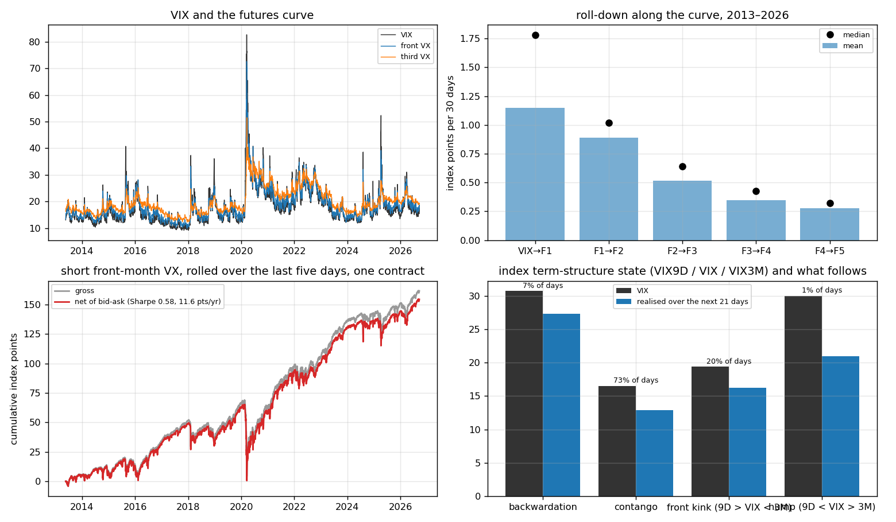
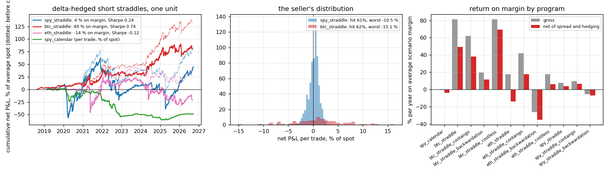

# ProjectI — volatility dynamics research and systematic volatility strategies

**Question.** Which volatility dynamics are stable enough to trade? Measured on complete free histories: the gap between implied and subsequently realised variance by asset and tenor, how well realised variance can be forecast and whether implied vol adds to the forecast, the size and persistence of the earnings and FOMC premia, the VIX term structure and the roll of its futures, the calendar of a 24/7 market, and what each of these leaves after bid–ask, hedging costs and margin when turned into a systematic strategy.

**Answer (§Results).**

- *The premium is universal, and it lives in the wings.* Every one of fifteen implied-vol series prices above the vol that follows: 3.5 points on the S&P 500 over 5,007 days (95 % block-bootstrap CI [2.6, 4.3]), 3.0–3.6 on the other equity indices, 3.7–3.9 on Apple and Amazon, 5.9 on oil, 2.4 on gold, 1.5 on Treasuries, positive in 72–85 % of months. On the S&P it rises with tenor (3.6 at 9 days, 5.1 at 3 months, 5.5 at 6 months) and with the level (2.2 points in the lowest VIX tercile, 4.7 in the highest), and the slope of realised on implied variance is 0.9, so the market is calibrated on average and pays the premium mainly for the tails. The same names measured at the money, from the vendor's ATM series on 48 stocks, show 0.3 points; the Cboe single-name indices, which are variance swaps, show 2.6–3.9. On Bitcoin the split is explicit: since 2021 DVOL (the variance-swap-style index) sits 8.2 points above subsequent realised vol, the print-implied ATM vol 4.1; on Ether 4.0 against −1.0. Half of the crypto premium and most of the single-name premium is convexity, not ATM level.
- *Implied vol subsumes the realised history.* Walk-forward over 4,000 days per asset, adding the implied index to HAR-RV lowers QLIKE for 14 of 15 series, decisively for oil and the five single names (Diebold–Mariano −3 to −7) and by 10–15 % without formal significance on the indices (overlapping 21-day targets leave DM at −1.3); the encompassing regression puts 0.8–1.1 of the weight on the implied-only forecast and 0.1 or less on HAR. GARCH beats HAR on the indices; both lose to the implied. Ether is the one market where the print-implied adds nothing.
- *Events are priced about right; the seller's edge is the spread.* On 62 FOMC days the S&P's RMS move is 1.02 times the VIX-implied daily move against 1.00 on other days, VIX1D 0.98, and the pre-announcement elevation of VIX1D is about 4 points; VIX9D falls 0.8 points from the day before to the day after. Over 1,093 earnings events in 47 names the straddle's implied jump (stripped of the diffusion from two expiries) averages 6.0 % against a realised |move| of 4.7 %, above it on 67 % of events, but in RMS terms 6.8 against 6.4: the seller's mean is +0.27 % of spot before the spread and −0.43 % after it, hit rate 55 %, worst −25.5 %.
- *The VX roll is the one clean carry.* The futures curve sits in contango 85 % of days with 0.9 points of roll-down per 30 days at the front; shorting the front month, rolled over the last five days, earns 12.1 points a year gross and 11.6 net of bid–ask ($11.6k a contract-year), Sharpe 0.58, with a 65-point drawdown and a −19-point day in March 2020. Conditioning on yesterday's curve does not help: the filtered version earns 7.2 points a year (the same-day filter, a look-ahead, would have shown a Sharpe of 2.5). VVIX runs 33 points above the realised vol of the 30-day future.
- *Strategies.* A delta-hedged short SPY straddle on 697 entries since 2019 nets 0.05 % of spot a trade, 4.0 % a year on scenario margin, Sharpe 0.24, with 2022 costing more than 2019–2021 earned; entering only when VIX3M > VIX lifts it to 6.5 % and Sharpe 0.42 (the 54 backwardation entries lose 7 % a year). A stop at half the premium, chosen on 2019–2021, raises the in-sample return from 8.9 to 11.5 % and the out-of-sample from 0.7 to 2.1 %. The vega-neutral calendar loses 4 % a year after spreads. BTC 30-day straddles net 1.1 % of spot a trade, 49 % a year on margin at Sharpe 0.74 with a 121 % drawdown and two negative years of nine; ETH loses 14 % a year, or breaks even costless. Crypto weekends run at 58 % of weekday variance (falling to 38–40 % since 2023), the half-hours after the funding marks at 1.3–1.4 times, and the 7-day implied is 3.3 points lower on Fridays than the following Monday, so the term structure prices the weekend.

Python package `voldyn`. The surface engine (Black prices and Greeks, the implied-vol solver, SSVI slices, forwards from parity) is Project H's `optmm`, imported from the sibling checkout or, for CI, from the copy vendored under `voldyn/_optmm` (never edited here). 11 tests, CI, `notebooks/results.ipynb`, `report.pdf`.

---

## Layout

| path | what |
|---|---|
| `tools/download.py` | every source, incremental: Deribit history (all BTC and ETH option prints since the first trade, DVOL, 5-minute perpetual candles), Cboe (19 vol indices, every VX contract file), DoltHub (daily implied/realised vol table, option chains, earnings dates), Yahoo bars, New York Fed rates |
| `voldyn/data.py` | loaders, the implied-index → underlying map, the DuckDB views for the post-trade SQL |
| `voldyn/surface.py` | the Project H dependency (installed → sibling `../ProjectH` → vendored) |
| `voldyn/realised.py` | close-to-close, Parkinson, Garman–Klass, Rogers–Satchell, Yang–Zhang; 5-minute RV, bipower variation, tripower quarticity, the Barndorff-Nielsen–Shephard jump test |
| `voldyn/forecast.py` | HAR-RV, HAR + implied, implied only, GARCH(1,1) by ML, random walk; rolling refits; QLIKE; Diebold–Mariano with Newey–West; the encompassing regression |
| `voldyn/premia.py` | the variance risk premium (block bootstrap, by year, by regime, RV-on-IV regression), skew-stickiness ratio and the sticky-strike / sticky-moneyness test on daily SSVI fits |
| `voldyn/crypto.py` | the print-implied constant-maturity term structure (7 / 30 / 60 / 90 days) from every Deribit trade, the DVOL cross-check, 5-minute realised measures, hour-of-week and funding-window effects, the implied weekend |
| `voldyn/events.py` | earnings: ATM straddle, implied move stripped of the diffusion from two expiries, realised move, the seller's P&L after spread; FOMC: index paths, realised against implied on decision days |
| `voldyn/vix.py` | index term-structure states, the VX curve and roll-down by contract month, the short-front roll net of bid–ask, VVIX against the constant-maturity future |
| `voldyn/strategies.py` | the option engine (daily Black–Scholes marks refreshed from later chains, daily delta hedge at a stated cost, settlement at intrinsic, scenario margin, stop-loss) and the programs: SPY straddles (unconditional, by term-structure state, walk-forward stop), SPY calendars, BTC/ETH 30-day straddles |
| `voldyn/run.py` | `python -m voldyn build | forecast | premia | events | vix | strategies | all [--quick]` → `results/*.json`, `data/derived/*.parquet` |
| `data/reference/fomc.csv` | FOMC decision dates 2019–2026 transcribed from the Federal Reserve calendar, unscheduled meetings marked |
| `tests/`, `.github/workflows/ci.yml` | estimators on paths with known variance, jump-test size and power, HAR recovery, QLIKE at the truth, DM sign, GARCH persistence, the planted premium and its interval, the VX roll on a synthetic curve, the option engine's decomposition and gap, the scenario margin and stop, implied-move stripping of a planted jump; CI runs them and the VIX complex on the committed Cboe data |
| `scripts/run_all.sh`, `plots.py`, `summarize.py`, `report.py` | pipeline, six figures, `results/summary.md`, `report.pdf`; `notebooks/results.ipynb` |

Run: `pip install numpy pandas pyarrow scipy duckdb matplotlib fpdf2 pytest`, then `scripts/run_all.sh --download` (the Deribit history is about 1 GB and three to four hours of polite API calls; the DoltHub chains another two) or `scripts/run_all.sh` on the committed derived data.

---

## Data

| layer | source | notes |
|---|---|---|
| implied vol, US | Cboe daily histories: VIX, VIX9D, VIX3M, VIX6M, VIX1D, VVIX, SKEW, VXN (Nasdaq-100), RVX (Russell 2000), VXD (Dow), GVZ (gold), OVX (oil), VXTLT (20y+ Treasuries), VXEEM, and VXAPL / VXAZN / VXGOG / VXIBM / VXGS | model-free 30-day implied vols; 2009–2011 to 2026-09-17; free CSVs |
| VX futures | Cboe per-contract settlement files, 169 contracts, 2013-05 to 2026-09 | settle, volume, open interest |
| implied vol, crypto | Deribit history API: every BTC (from 2016-11) and ETH (from 2019-03) option print with the exchange's IV, mark, index and block flag; DVOL daily and hourly since 2021 | the only options market whose complete print history is free |
| realised, crypto | 5-minute BTC-PERPETUAL (from 2018-08) and ETH-PERPETUAL (from 2019) candles | 288 bars a day, 24/7 |
| US option chains | DoltHub `post-no-preference/options` (`option_chain`): end of day, about three expiries and twenty strikes a day, weekly snapshots 2019–2023 and most days since; SPY and fifty large caps around their earnings | sparse by construction; the ETFs beyond SPY are not in the table, which is why the cross-asset premia use the Cboe indices |
| implied/realised table | the same database's `volatility_history`: the vendor's current IV and HV per name per day, 2019-02 on | definitions are the vendor's; used only as a cross-check |
| earnings dates | DoltHub `post-no-preference/earnings` (`earnings_calendar`), with before-open / after-close | |
| underlyings | Yahoo daily OHLC and dividends for the indices, ETFs and names; SOFR/EFFR from the New York Fed | adjusted consistently before the range estimators |
| FOMC | `data/reference/fomc.csv` | |

---

## Method

**Realised variance.** Daily, from OHLC (Parkinson $\frac{(\ln H/L)^2}{4\ln 2}$, Garman–Klass, Rogers–Satchell, Yang–Zhang), and intraday from 5-minute closes: $RV_t=\sum_i r_i^2$, bipower variation $BV_t=\frac{\pi}{2}\sum_i|r_i||r_{i-1}|$, and the BNS ratio test $z=\frac{(RV-BV)/RV}{\sqrt{(\pi^2/4+\pi-5)\,n^{-1}\max(1,TQ/BV^2)}}$ with the jump variation $\max(RV-BV,0)$ on days with $z>1.96$.

**Forecasting.** HAR-RV in logs, $\log RV_{t+1:t+h}=b_0+b_d\log RV_t+b_w\log RV_{t-4:t}+b_m\log RV_{t-21:t}+\varepsilon$, with and without $\log(IV_t^2)$; GARCH(1,1) by Gaussian ML iterated to the horizon; the trailing mean as the floor. Refit every 21 days on the trailing 1,000 days (730 for crypto), scored by $\mathrm{QLIKE}=\frac{RV}{\hat\sigma^2}-\log\frac{RV}{\hat\sigma^2}-1$ and by Diebold–Mariano with $h-1$ Newey–West lags.

**The premium.** $VRP_t=IV_t^2-RV_{t+1:t+h}^2$ in annualised variance, $h$ the trading days the index covers; reported in variance points and as the vol gap $IV-RV$, with circular block-bootstrap intervals (block $=h$), by year, by tercile of the level and by sign of the term-structure slope; and the Canina–Figlewski regression $RV^2=a+bIV^2$ with Newey–West errors.

**Skew.** Daily SSVI slices (Gatheral–Jacquier: $w(k)=\tfrac{\theta}{2}\big(1+\rho\varphi k+\sqrt{(\varphi k+\rho)^2+1-\rho^2}\big)$, butterfly conditions enforced) of the expiry nearest 30 days, from the day's prints (BTC) or the chain (SPY). Bergomi's skew-stickiness ratio from $\Delta\sigma_{ATM}=-\mathrm{SSR}\cdot\mathcal S_k\cdot\Delta\ln F$; sticky strike against sticky moneyness by the mean absolute day-to-day change of the fitted vol at yesterday's strike against today's ATM.

**Earnings.** With $w_1,w_2$ the ATM total variances of the two expiries spanning the event and one diffusion vol, $J^2=\frac{w_1T_2-w_2T_1}{T_2-T_1}$ is the implied jump variance; the $0.8\times$straddle rule is reported beside it. Realised: the log close-to-close move over the announcement. The seller's P&L: short the straddle at the bid, closed at the next chain's mid or at intrinsic.

**Strategies.** Legs marked with Black–Scholes at the marking vol (entry IV, replaced when a later chain quotes the leg), hedged daily to zero delta, settled at intrinsic, so $dP=\Delta(\text{mark})+\text{hedge}\cdot dS-\text{costs}$ and the decomposition sums. Margin: worst loss over spot $\pm15\%$ × vol $\pm30\%$, floor 10 % of short notional. Stop-loss levels chosen on the first half of the entries and applied to the second.

---

## Results

Figures from `scripts/plots.py`; every table in `results/summary.md`; the run in `report.pdf`.

### Data built

BTC: 12.2 million near-the-money prints into 3,406 days of implied term structure (Feb 2017 to Sep 2026); 2,956 days of 5-minute realised variance, annualised 67 %; BNS jump days 32 % at 5 %, 26 % at 1 %, jump variation 6 % of RV; the print-implied 30-day vol against DVOL: correlation 0.985, 4.0 points below it (the ATM-to-variance-swap gap). ETH: 7.2 million prints, 2,738 days from Mar 2019, 85 % annualised, 4.9 points below DVOL. SSVI slices: 3,459 BTC days (median error 1.8 vol points), 2,739 ETH days (1.6), 1,267 SPY days (1.0), every one butterfly-free. Range estimators run at 57–58 % of close-to-close on these underlyings because they exclude the overnight gap, so close-to-close is the realised leg throughout.

### The variance risk premium

| implied index | underlying | years | n | implied | realised | gap, vol pts | 95 % CI | months positive | RV on IV slope |
|---|---|---|---|---|---|---|---|---|---|
| DVOL index | Bitcoin | 2021–26 | 1,974 | 63.1 | 55.4 | **8.16** | [5.20, 11.05] | 71 % | 0.51 |
| OVX | crude oil | 2009–26 | 4,248 | 41.7 | 36.7 | **5.91** | [4.35, 7.33] | 79 % | 0.42 |
| DVOL index | Ether | 2021–26 | 1,974 | 77.7 | 75.3 | 4.03 | [−0.25, 8.20] | 63 % | 0.63 |
| VXAZN | Amazon | 2011–26 | 3,919 | 35.4 | 32.9 | 3.85 | [2.81, 4.91] | 74 % | 0.87 |
| VXAPL | Apple | 2011–26 | 3,919 | 30.7 | 28.3 | 3.72 | [2.63, 4.74] | 74 % | 0.76 |
| VXEEM | EM equities | 2011–26 | 3,873 | 24.1 | 21.5 | 3.57 | [2.62, 4.30] | 81 % | 0.64 |
| ATM from prints | Bitcoin | 2018–26 | 2,926 | 64.7 | 64.0 | 3.53 | [−0.63, 7.30] | 66 % | 0.48 |
| RVX | Russell 2000 | 2009–26 | 4,249 | 24.9 | 22.7 | 3.53 | [2.47, 4.37] | 82 % | 0.89 |
| VIX | S&P 500 | 2006–26 | 5,007 | 21.5 | 19.6 | 3.51 | [2.58, 4.33] | 83 % | 0.90 |
| VXGS | Goldman Sachs | 2011–26 | 3,919 | 31.2 | 29.0 | 3.46 | [2.21, 4.54] | 77 % | 0.73 |
| VXD | Dow Jones | 2009–26 | 4,249 | 18.4 | 16.5 | 3.41 | [2.46, 4.15] | 85 % | 0.99 |
| VXN | Nasdaq-100 | 2009–26 | 4,256 | 22.6 | 20.8 | 3.00 | [2.06, 3.80] | 79 % | 0.83 |
| VXGOG | Alphabet | 2011–26 | 3,919 | 29.4 | 27.9 | 2.67 | [1.70, 3.64] | 71 % | 0.79 |
| VXIBM | IBM | 2011–26 | 3,919 | 26.1 | 25.7 | 2.64 | [1.45, 3.76] | 74 % | 1.19 |
| GVZ | gold | 2009–26 | 4,248 | 18.6 | 16.9 | 2.36 | [1.76, 2.91] | 79 % | 0.72 |
| VXTLT | 20y+ Treasuries | 2006–26 | 4,997 | 16.1 | 14.9 | 1.48 | [1.03, 1.89] | 72 % | 0.70 |
| ATM from prints | Ether | 2019–26 | 2,707 | 77.9 | 83.0 | −1.75 | [−6.79, 2.65] | 55 % | 0.65 |

By tenor on the S&P: 3.64 [3.21, 4.01] at 9 days, 3.51 at 30, 5.12 [3.43, 6.50] at 93, 5.45 [2.88, 7.76] at 184. By regime: 2.25 points in the lowest VIX tercile (mean VIX 12.9), 3.52 in the middle, 4.75 in the highest (28.6); 3.76 when VIX3M > VIX, 4.38 in the 325 backwardated days with an interval that spans zero. BTC by tenor from the prints: 6.2 points at 7 days, 3.5–4.1 at 30–90; against 5-minute realised variance the 30-day ATM premium is 0.2 points, against DVOL 8.2. The vendor's ATM series on 48 single names gives a cross-sectional mean premium of 0.32 points (median 0.47, 69 % of names positive) while the Cboe single-name indices, 2.1–3.1 points above the vendor's ATM vol at a correlation of 0.98, give 2.6–3.9.

Skew from the daily SSVI fits: mean 25-delta skew 5.8 points on SPY and 3.8 on BTC. Bergomi's skew-stickiness ratio is 1.27 (s.e. 0.03, R² 0.67) on SPY and 1.67 (0.08, R² 0.13) on BTC, both between sticky strike (1) and the local-volatility value (2); the day-to-day vol change is smaller at a fixed strike than at fixed moneyness on both (0.72 vs 1.23 points on SPY, 1.25 vs 2.84 on large moves), so the surface moves in the sticky-strike frame with the ATM vol falling as the index rises.

### Forecasting realised variance

| asset | random walk | GARCH | HAR | HAR + implied | implied only | DM, HAR+IV vs HAR | encompassing weight, implied / HAR |
|---|---|---|---|---|---|---|---|
| S&P 500 | 0.60 | 0.43 | 0.46 | 0.40 | 0.40 | −1.3 | 0.80 / 0.06 |
| Nasdaq-100 | 0.43 | 0.32 | 0.33 | 0.28 | 0.28 | −1.5 | 0.76 / 0.19 |
| Russell 2000 | 0.39 | 0.30 | 0.34 | 0.28 | 0.28 | −1.3 | 0.82 / 0.05 |
| Treasuries (TLT) | 0.21 | 0.19 | 0.21 | 0.17 | 0.17 | −1.7 | 0.79 / 0.18 |
| gold | 0.35 | 0.26 | 0.26 | 0.22 | 0.21 | −1.9 | 1.13 / −0.26 |
| crude oil | 0.39 | 0.31 | 0.34 | 0.25 | 0.24 | **−3.0** | 0.91 / 0.02 |
| Apple | 0.40 | 0.28 | 0.28 | 0.21 | 0.21 | **−3.4** | 0.88 / −0.05 |
| Amazon | 0.53 | 0.32 | 0.30 | 0.19 | 0.19 | **−7.4** | 0.95 / −0.07 |
| IBM | 0.71 | 0.41 | 0.45 | 0.30 | 0.30 | **−4.1** | 1.03 / −0.13 |
| Bitcoin | 0.26 | 0.17 | 0.17 | 0.16 | 0.16 | −1.1 | 0.77 / 0.09 |
| Ether | 0.26 | 0.20 | 0.19 | 0.21 | 0.20 | +0.9 | 0.67 / 0.07 |

QLIKE on the 21-day (30-day crypto) realised variance, about 4,000 days per asset, refits every 21 days on a 1,000-day window. The full table of fifteen assets, with RMSE in vol, is in `results/summary.md`.

### Events

FOMC, 62 decision days 2019–2026: S&P |move| 0.95 % against 0.79 % on other days; the RMS move is 1.02 × the VIX-implied daily move on decision days and 1.00 × otherwise; 0.98 × VIX1D on the 35 days it exists; TLT 0.88 × VXTLT. VIX is unchanged on the day on average (+0.05, down on 56 % of days); VIX9D falls 0.84 points from the day before to the day after; VIX1D runs about 4 points above its neighbours on the day before.

Earnings, 1,093 events in 47 names 2020–2026: implied jump 6.0 % (0.8 × straddle rule 5.4 %), realised |move| 4.65 %, implied above realised on 67 % of events, median ratio 1.44; RMS implied 6.8 % against RMS realised 6.4 %; Spearman between implied and |realised| 0.43. The seller: +0.27 % of spot per event at mid, −0.43 % after the quoted spread, hit rate 55 %, worst −25.5 %; positive after spread in 2023 only. The premium is fairly stable in implied terms (4.1–7.0 % a year) and the realised side varies more (3.4–5.9 %).

### The VIX complex

| state (VIX9D / VIX / VIX3M) | share of days | mean VIX | realised next 21 days | premium | VIX change over 21 days |
|---|---|---|---|---|---|
| contango | 72.7 % | 16.5 | 12.9 | 3.67 | +0.87 |
| front kink (9D > VIX < 3M) | 19.7 % | 19.4 | 16.2 | 3.16 | −0.87 |
| backwardation | 6.9 % | 30.7 | 27.3 | 3.42 | −5.91 |
| hump | 0.7 % | 30.0 | 21.0 | 8.99 | −7.65 |

VX curve 2013–2026, 3,356 days, F2 > F1 on 85 % of days; roll-down per 30 days 1.15 points VIX→F1, 0.89 F1→F2, 0.51 F2→F3, 0.35 F3→F4. Short front-month roll, one contract: gross 12.1 points a year, bid–ask 0.54, net 11.6 ($11,584 per contract-year), daily Sharpe 0.58, drawdown 64.6 points, worst day −19.2 (2020-03-16); positive in 12 of 14 years (2018 −16.8, 2020 −3.0). Filtered on yesterday's contango: 7.2 points a year, Sharpe 0.54. VVIX 95.5 against a realised vol of the 30-day constant-maturity future of 64.0 (premium 33.1 points, CI [29.0, 37.0]); VVIX is 101 in the backwardated slope tercile and 90 in the flat one.

### Strategies

| program | trades | years | hit | gross / trade, % spot | cost | net | worst | return on margin, %/yr | max DD, % margin | Sharpe |
|---|---|---|---|---|---|---|---|---|---|---|
| SPY short straddle, all entries | 697 | 7.6 | 61 % | 0.11 | 0.06 | 0.05 | −10.5 | 4.0 | 68 | 0.24 |
| SPY, VIX3M > VIX at entry | 643 | 7.6 | 61 % | 0.16 | 0.05 | 0.10 | −3.7 | 6.5 | 61 | 0.42 |
| SPY, VIX3M ≤ VIX at entry | 54 | 6.3 | 59 % | −0.47 | 0.12 | −0.59 | −10.5 | −7.0 | 86 | −0.83 |
| SPY, no stop, 2019–21 / 2022–26 | 349 / 348 | | 66 / 55 % | 0.20 / 0.02 | | 0.13 / −0.03 | | 8.9 / 0.7 | 44 / 56 | 0.67 / 0.05 |
| SPY, stop at ½ premium (chosen), 2019–21 / 2022–26 | 349 / 348 | | 66 / 55 % | 0.25 / 0.04 | | 0.17 / −0.01 | −7.3 / −4.4 | 11.5 / 2.1 | 35 / 47 | 0.88 / 0.16 |
| SPY calendar, vega-neutral | 667 | 7.6 | 47 % | 0.01 | 0.08 | −0.07 | −3.4 | −4.0 | 48 | −0.49 |
| BTC 30-day straddle | 95 | 8.1 | 62 % | 1.61 | 0.54 | 1.07 | −15.1 | 49.4 | 121 | 0.74 |
| BTC, iv60 > iv30 at entry | 71 | 8.1 | 59 % | 1.20 | 0.54 | 0.66 | −15.1 | 38.1 | 81 | 0.81 |
| BTC, costless | 95 | 8.1 | 64 % | 1.61 | 0.20 | 1.41 | −14.8 | 69.3 | 118 | 1.04 |
| ETH 30-day straddle | 88 | 7.5 | 51 % | 0.18 | 0.54 | −0.37 | −23.6 | −13.9 | 277 | −0.12 |
| ETH, costless | 88 | 7.5 | 53 % | 0.18 | 0.20 | −0.03 | −23.3 | 6.1 | 260 | 0.06 |

The SPY straddle's year by entry: 2019 +34, 2020 +30, 2021 +108, 2022 −212, 2023 +78, 2024 −51, 2025 +81, 2026 +127 (dollars per unit on a ~$450 underlying). The BTC program's 2021 and 2024 carry it; 2023 and 2026 are negative. The "costless" rows keep the perpetual hedging cost and drop only the option spread, so they bound what a maker rather than a taker would keep.

Crypto calendar: weekend variance is 58 % of weekday variance on BTC (55 % against 72 % annualised) and 61 % on ETH, falling from 0.66–0.82 in 2018–19 to 0.38–0.45 in 2023–25; the half-hours after the 00:00, 08:00 and 16:00 UTC funding marks carry 1.28 × (BTC) and 1.41 × (ETH) the variance of other hours; the 7-day implied vol is 3.3 (BTC) and 3.5 (ETH) points lower on Fridays than on the following Monday across 485 / 391 weeks, so the weekend is priced.

---

## Validation

- Every estimator on simulated paths with known variance (range estimators carry the expected discretisation bias of a few per cent at 390 bars); the jump test's size on continuous paths and its power on planted jumps.
- HAR recovers on a simulated log-AR(1) variance; QLIKE is minimised at the truth; the DM test has the right sign and size; GARCH ML recovers persistence.
- The premium estimator recovers a planted 4-point premium with an interval that covers it; the block bootstrap of a constant is exact.
- The VX roll engine earns the known roll-down of a synthetic contango curve; the conditional filter uses the previous day's curve only.
- The option engine: option plus hedge minus costs equals net to 1e-9; a hedged short straddle earns more the lower the realised vol and is near zero at realised = implied; margin positive; the stop fires on a gap.
- Implied-move stripping recovers a planted jump variance to 0.3 vol points.
- The print-implied 30-day vol is checked against Deribit's own DVOL where they overlap.

## Limitations, stated

The DoltHub chains are sparse and irregular, so SPY strategies are marked to model between chain dates and the earnings straddle is often quoted several days before the event. Crypto option spreads are an assumption (1.5 vol points a side). The OTC vol markets DRW quotes by voice have no free history. The Cboe indices are model-free variance swaps, so the premium measured is the variance swap premium, larger than the ATM straddle premium a seller of a single strike earns. Single-name vol indices (VXAPL and the others) were discontinued by Cboe for periods and resumed; the histories carry gaps. The FOMC table has 62 events; the earnings table has the names and years the chain table covers.

## References

Corsi, *A simple approximate long-memory model of realized volatility*, J. Financial Econometrics 2009 · Barndorff-Nielsen, Shephard, *Econometrics of testing for jumps in financial economics using bipower variation*, J. Financial Econometrics 2006 · Carr, Wu, *Variance risk premiums*, Review of Financial Studies 2009 · Bollerslev, Tauchen, Zhou, *Expected stock returns and variance risk premia*, RFS 2009 · Canina, Figlewski, *The informational content of implied volatility*, RFS 1993 · Christensen, Prabhala, *The relation between implied and realized volatility*, JFE 1998 · Patton, *Volatility forecast comparison using imperfect volatility proxies*, J. Econometrics 2011 · Diebold, Mariano, *Comparing predictive accuracy*, JBES 1995 · Bergomi, *Smile dynamics IV*, Risk 2009 · Gatheral, Jacquier, *Arbitrage-free SVI volatility surfaces*, Quantitative Finance 2014 (arXiv:1204.0646) · Yang, Zhang, *Drift-independent volatility estimation based on high, low, open, and close prices*, J. Business 2000 · Garman, Klass, *On the estimation of security price volatilities from historical data*, J. Business 1980 · Dew-Becker, Giglio, Le, Rodriguez, *The price of variance risk*, JFE 2017 · Alexander, Deng, Zou, *Hedging with automatic liquidation and leverage selection on bitcoin futures*, EJOR 2021 (crypto microstructure) · Lucca, Moench, *The pre-FOMC announcement drift*, J. Finance 2015 · Barth, So, *Non-diversifiable volatility risk and risk premiums at earnings announcements*, The Accounting Review 2014.
